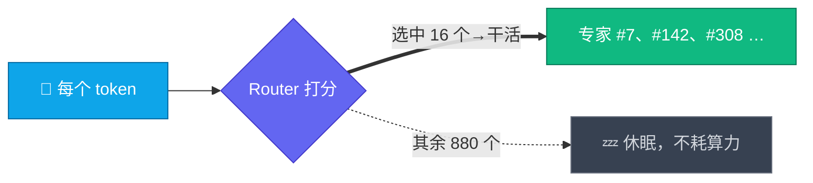

# 一、架构拆解：2.8T 是怎么炼成的

> 本文把 Kimi K3 官方博客里的架构名词逐个拆开讲清楚。信息核对至 2026-07-25；技术报告尚未发布，标注「待报告确认」的部分以后续官方报告为准。

## 总览：一张图看懂 K3 的堆料思路

官方口径：这些改动叠加后，**整体 scaling 效率比 K2 提升约 2.5×**——即同样算力换来更多“智能”。

---

## 1. Kimi Delta Attention（KDA）：1M 上下文的地基

先说它要解决的问题。标准 softmax 注意力里，每个新 token 都要和前面所有 token 算一遍相关性，序列长度 n，开销就是 O(n²)，放到 1M 上下文，计算和显存都撑不住。现成的替代方案是线性注意力，开销近似 O(n)，但历史会被压进一个固定大小的状态里，细节发糊，想精确回看某个 token 基本没戏：

| 路线 | 开销 | 记忆精度 |
| --- | --- | --- |
| softmax 注意力 | O(n²)，1M 下计算/显存都不可承受 | 高（能逐 token 精确回看） |
| 线性注意力 | 近似 O(n) | 低（历史被压进固定大小的状态，会“糊”） |

KDA 走的是混合路线：线性注意力打底，把历史压缩进固定大小的循环状态，负责把序列撑长；状态更新用 Delta 规则，新信息写入前先把旧的相关记忆擦掉再写，而不是无脑往上叠；再配门控机制守住精度。有点像人读长篇小说，没人逐字背全文，实际维护的是一份随读随更新的剧情摘要，新人物登场时把旧印象擦掉重写。

单独拿一节讲它，是因为这东西的分量不止于算法本身：

- K3 的 1M token 上下文就是靠它撑起来的；
- 官方把 KDA + prefill cache 的实现贡献给了 vLLM 社区（随权重发布），开源生态从第一天就能高效推理，这在超大模型开源史上相当少见；
- prefill cache 对长提示词场景（反复携带的系统提示、代码库、文档）是刚需，不然每次请求都得全量重算。

沿革上，K2.6 用的是 MLA（Multi-head Latent Attention，DeepSeek 系路线）；K3 改成 KDA 为主，中间交错堆叠 Gated MLA（带门控的 MLA，官方称改善注意力选择性），需要精确回看时仍有全注意力可用，相当于关键时刻翻回原文核对。两种块的具体配比官方没说，待报告确认。

## 2. Attention Residuals（AttnRes）：深度方向的“选择性回读”

Transformer 靠残差连接把浅层信息往深处传，但残差是无差别累加：几百层叠下来，早期的精细信息被一层层稀释，也就是所谓的表征塌缩。模型越深越严重，到 K3 这个深度，官方干脆把“信息如何跨层流动”当成一等公民问题来处理。

AttnRes 的改法，是把残差变成跨深度的选择性检索：后面的层按需从前面若干层拉取表征，而不是照单全收。传统残差像传话游戏，每一层往下传时都混进自己的理解，传到第一百层早走样了；AttnRes 相当于让第一百层直接给第十层打电话。

和上一节放在一起记就行：KDA 管序列方向（token 与 token 之间）的信息流，AttnRes 管深度方向（层与层之间）的。一横一纵。

## 3. Stable LatentMoE：896 选 16 的极限稀疏

2.8T 参数不是每次全用。每个 token 过来，Router 从 896 个专家里挑 16 个干活，其余 880 个原地休眠、不耗算力——参数能堆到 2.8T 而算力不爆炸，靠的就是这个。

和 K2.6 摆在一起看：

| | K2.6 | K3 |
| --- | --- | --- |
| 总专家数 | 384 | **896** |
| 每 token 激活 | 8 | **16** |
| 总参数 | 1T | 2.8T |
| 公布的激活参数 | 32B | 未公布（待报告确认） |

稀疏到这个程度，有两个问题绕不过去。

一是路由会不会塌。专家多到 896 个，Router 很容易偏心：活全涌向少数明星专家，其余的训不到、慢慢废掉。传统解法是加一个靠启发式更新的负载均衡损失，但那个超参出了名的难伺候，紧一点专家学不出分工，松一点负载直接崩。K3 的 Quantile Balancing 换了个思路，专家负载分配直接从 router 打分的分位数推导出来，把这个超参整个砍掉——路由均衡从调参艺术变成了统计推导。

二是训练会不会炸。配了两个稳定器：Per-Head Muon 把 Muon 优化器拆到每个注意力头独立自适应，原来是全班统一进度，现在每人一张课表；SiTU（Sigmoid Tanh Unit）是新激活函数，官方称改善激活控制，数值范围更稳、利于低精度训练，细节待报告确认。

至于名字里的 "Latent"，官方没展开。从命名推测和专家共享低秩/潜在空间有关——同样待报告确认，别当事实引用。

## 4. MXFP4 权重 + MXFP8 激活：为开源部署铺路

MX（Microscaling）是 OCP 联盟的开放低精度格式标准，块级共享缩放因子。K3 的特别之处在于从 SFT 阶段起就做量化感知训练（QAT），交付直接给 MXFP4 权重 + MXFP8 激活。这跟常见的“训完再压缩”（PTQ）不是一回事：模型在训练中后期就已经适应了 4-bit 的粗颗粒世界，上线不掉水准——拳击里“戴着拳套训练、戴着拳套比赛”和“裸拳训练、临场套拳套”的区别。

对开源用户来说这是实打实的诚意。2.8T × 4bit ≈ 1.4 TB 裸权重，要是按 FP16 交付就是 5.6 TB，直接劝退所有人。另外 MX 是开放标准，多厂商硬件都能支持——官方在内核优化评测里特意提了"另一家厂商的 GPGPU"，国产卡适配大概率已经在路上。

## 5. 训练与推理基础设施

- **全平衡专家并行训练**：静态 shape、关键路径零 host 同步，防止专家负载不均拖垮大规模并行吞吐；
- **部署建议**：64+ 加速卡的超节点（大高带宽通信域对 MoE 推理同样关键）；
- **Mooncake 分离式推理**：官方 API 基于 Mooncake（prefill/decode 分离架构），编程负载缓存命中率 >90%，这是 $0.30/M 缓存价的底气。

---

## 和 K2 → K3 的一年对比

| | K2（2025-07） | K2.6 | K3（2026-07） |
| --- | --- | --- | --- |
| 总参数 | 1T | 1T | 2.8T |
| 注意力 | MLA | MLA | KDA + Gated MLA + AttnRes |
| 上下文 | 128K | 256K | 1M |
| 视觉 | ❌ | MoonViT 外挂 encoder | 原生多模态 |
| 权重格式 | FP8 | 原生 INT4 | MXFP4 |
| 优化器 | Muon | Muon | Per-Head Muon |

过去 12 个月里有 9 个月，开源模型的参数上界都由 Kimi 系列保持。K3 是这条"规模前沿"路线的延续——而且这次把 1M 上下文、原生视觉、4-bit 交付三件事同时做了。

---

## 名词速查表

被术语绕晕了就回来翻这张表：

| 名词 | 它是什么 | 一句话记忆 |
| --- | --- | --- |
| KDA | 混合线性注意力 | 维护“剧情摘要”而非逐字背诵，撑起 1M 上下文 |
| Gated MLA | 带门控的全注意力层 | 关键时刻“翻回原文核对” |
| AttnRes | 跨层选择性残差 | 深层可以给浅层“直接打电话” |
| Stable LatentMoE | 极稀疏专家系统 | 896 个专家每次只叫醒 16 个 |
| Quantile Balancing | 分位数路由均衡 | 专家分活从“调参艺术”变“统计推导” |
| Per-Head Muon | 按注意力头拆分的优化器 | 每个头一张个性化课表 |
| SiTU | 新激活函数 | 数值更稳，为低精度训练服务（细节待报告） |
| MXFP4 / MXFP8 | 开放低精度格式（OCP 标准） | 4-bit 权重让 2.8T 压到 1.4TB |
| QAT | 量化感知训练 | “戴着拳套训练”，交付不掉精度 |
| Mooncake | prefill/decode 分离推理架构 | 缓存命中率 >90% 和 $0.30/M 缓存价的底气 |

## 最后

这篇太长的话，记住三件事就够了：K3 的“长”来自 KDA 混合注意力，线性打底、门控保准；“大”来自 896 选 16 的极限稀疏，Quantile Balancing、Per-Head Muon 和 SiTU 负责让它不塌不炸；“能部署”来自 SFT 起的 QAT，交付即 4-bit，1.4TB 让开源 2.8T 从口号变成能下载的东西。

---

**来源**：[Kimi K3 官方博客](https://www.kimi.com/blog/kimi-k3)（架构与训练章节）、[Kimi K3 Quickstart](https://platform.kimi.ai/docs/guide/kimi-k3-quickstart)、Northflank 技术导读（2026-07-16）。技术报告发布后本文将全面校订。

⬅️ [返回目录](../README.md) ｜ ➡️ 下一篇：[跑分导读](benchmarks.md)
