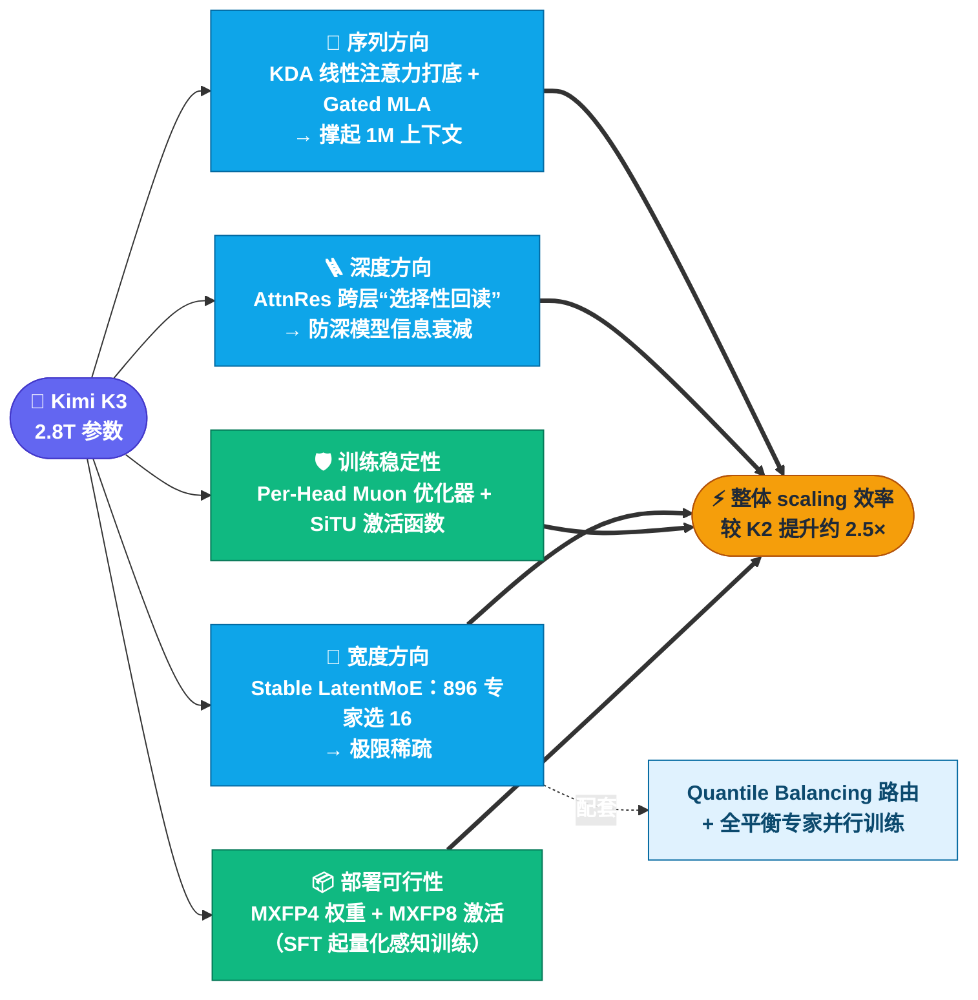

# 一、架构拆解：2.8T 是怎么炼成的

> 本文把 Kimi K3 官方博客里的每个架构名词翻译成人话。信息核对至 2026-07-25；技术报告尚未发布，标注「待报告确认」的部分以后续官方报告为准。

## 总览：一张图看懂 K3 的堆料思路

官方口径：这些改动叠加后，**整体 scaling 效率比 K2 提升约 2.5×**——即同样算力换来更多“智能”。

---

## 1. Kimi Delta Attention（KDA）：1M 上下文的地基

**它是什么**：一种混合线性注意力机制（hybrid linear attention）。传统 softmax 注意力的计算/显存开销随序列长度平方增长，1M token 下不可承受；线性注意力把开销压到近似线性，代价是记忆精度下降。KDA 走混合路线：线性部分负责"长"，配合门控保留"准"。

**为什么重要**：
- 它是 K3 支撑 **1M token 上下文**的基础设施；
- 官方已把 **KDA + prefill cache 的实现贡献给 vLLM 社区**（随权重发布），意味着开源生态从第一天就能高效推理——这在超大模型开源史上相当少见；
- prefill cache 对长提示词场景（反复携带的系统提示、代码库、文档）是刚需，否则每次都要全量重算。

**沿革**：K2.6 用的是 MLA（Multi-head Latent Attention，DeepSeek 系路线）；K3 的注意力层改为 KDA 为主 + **Gated MLA**（带门控的 MLA，官方称改善注意力选择性）。从博客的结构示意看，KDA 块与 Gated MLA 块按一定比例交错堆叠（待报告确认具体配比）。

## 2. Attention Residuals（AttnRes）：深度方向的"选择性回读"

**它是什么**：传统残差连接把前层信息"无差别累加"往深处传；AttnRes 改为**跨深度选择性检索**——后层按需从前面若干层拉取表征，而不是照单全收。

**为什么重要**：模型越深，均匀累加的残差流越容易稀释早期信息（表征塌缩）。K3 这个规模的深度下，官方认为"信息如何跨层流动"已经是一等公民问题。AttnRes 和 KDA 一横一纵：KDA 管序列方向的信息流，AttnRes 管深度方向的信息流。

## 3. Stable LatentMoE：896 选 16 的极限稀疏

**数字对比**：

| | K2.6 | K3 |
| --- | --- | --- |
| 总专家数 | 384 | **896** |
| 每 token 激活 | 8 | **16** |
| 总参数 | 1T | 2.8T |
| 公布的激活参数 | 32B | 未公布（待报告确认） |

**稀疏到这个程度，两个问题变成生死线**：

- **路由怎么不塌**：官方引入 **Quantile Balancing**——专家负载分配直接从 router 打分的分位数推导，砍掉了传统 MoE 里那个靠启发式更新、还极其敏感的负载均衡超参。一句话：路由均衡从"调参艺术"变成"统计推导"。
- **训练怎么不炸**：配套两个稳定器——
  - **Per-Head Muon**：把 Muon 优化器扩展为按注意力头独立优化，每个头有自己的自适应节奏；
  - **SiTU（Sigmoid Tanh Unit）**：新激活函数，官方称改善激活控制（数值范围更稳，利于低精度训练；细节待报告确认）。

**LatentMoE 的 "Latent"**：官方未详述，从命名推测与专家共享低秩/潜在空间有关（**待报告确认**，不要引用为事实）。

## 4. MXFP4 权重 + MXFP8 激活：为开源部署铺路

**它是什么**：MX（Microscaling）是 OCP 联盟的开放低精度格式标准，块级共享缩放因子。K3 从 **SFT 阶段起就做量化感知训练（QAT）**，最终交付 MXFP4 权重 + MXFP8 激活。

**为什么这是"开源诚意"设计**：
- 不是训完再事后量化（PTQ），而是训练时就让模型适应 4-bit——精度损失显著更小；
- 2.8T × 4bit ≈ **1.4 TB 裸权重**（对比：若 FP16 交付会是 5.6 TB，直接劝退所有人）；
- MX 是开放标准，多厂商硬件可支持——注意官方在内核优化评测里特意提了"另一家厂商的 GPGPU"，暗示国产卡适配已在路上。

## 5. 训练与推理基础设施

- **全平衡专家并行训练**：静态 shape、关键路径零 host 同步，防止专家负载不均拖垮大规模并行吞吐；
- **部署建议**：64+ 加速卡的超节点（大高带宽通信域对 MoE 推理同样关键）；
- **Mooncake 分离式推理**：官方 API 基于 Mooncake（prefill/decode 分离架构），编程负载缓存命中率 >90%，这是 $0.30/M 缓存价的底气。

---

## 和 K2 → K3 的一年对比

| | K2（2025-07） | K2.6 | K3（2026-07） |
| --- | --- | --- | --- |
| 总参数 | 1T | 1T | 2.8T |
| 注意力 | MLA | MLA | KDA + Gated MLA + AttnRes |
| 上下文 | 128K | 256K | 1M |
| 视觉 | ❌ | MoonViT 外挂 encoder | 原生多模态 |
| 权重格式 | FP8 | 原生 INT4 | MXFP4 |
| 优化器 | Muon | Muon | Per-Head Muon |

过去 12 个月里有 9 个月，开源模型的参数上界都由 Kimi 系列保持。K3 是这条"规模前沿"路线的延续——而且这次把 1M 上下文、原生视觉、4-bit 交付三件事同时做了。

---

**来源**：[Kimi K3 官方博客](https://www.kimi.com/blog/kimi-k3)（架构与训练章节）、[Kimi K3 Quickstart](https://platform.kimi.ai/docs/guide/kimi-k3-quickstart)、Northflank 技术导读（2026-07-16）。技术报告发布后本文将全面校订。

⬅️ [返回目录](../README.md) ｜ ➡️ 下一篇：[跑分导读](benchmarks.md)
