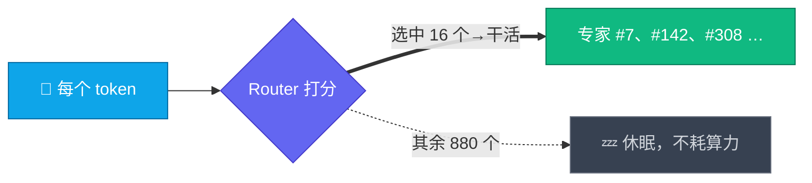

# 一、架构拆解：2.8T 是怎么炼成的

> 本文把 Kimi K3 官方博客里的每个架构名词翻译成人话。信息核对至 2026-07-25；技术报告尚未发布，标注「待报告确认」的部分以后续官方报告为准。

## 总览：一张图看懂 K3 的堆料思路

官方口径：这些改动叠加后，**整体 scaling 效率比 K2 提升约 2.5×**——即同样算力换来更多“智能”。

---

## 1. Kimi Delta Attention（KDA）：1M 上下文的地基

**一句话人话**：让模型读 100 万 token 时，既不至于“读到后面忘了前面”，也不至于“算到天荒地老”。

**先搞懂它解决什么问题**：标准 softmax 注意力里，每个新 token 都要和前面所有 token 算一遍相关性——序列长度 n，开销 O(n²)。两条已知路线各有致命短板：

| 路线 | 开销 | 记忆精度 |
| --- | --- | --- |
| softmax 注意力 | O(n²)，1M 下计算/显存都不可承受 | 高（能逐 token 精确回看） |
| 线性注意力 | 近似 O(n) | 低（历史被压进固定大小的状态，会“糊”） |

**KDA 的答案是混合**：线性注意力打底负责“长”——把历史压缩进固定大小的循环状态，Delta 规则控制状态更新（新信息写入前先“擦掉”旧的相关记忆再写，而不是无脑叠加）；门控机制保留“准”。

> 🍜 **类比（帮助理解，非严格对应）**：像人读长篇小说——不逐字背诵全文（softmax），而是维护一份随读随更新的“剧情摘要”，新人物登场时把摘要里的旧印象擦掉重写（Delta 规则）。

**为什么重要**：
- 它是 K3 支撑 **1M token 上下文**的基础设施；
- 官方已把 **KDA + prefill cache 的实现贡献给 vLLM 社区**（随权重发布），意味着开源生态从第一天就能高效推理——这在超大模型开源史上相当少见；
- prefill cache 对长提示词场景（反复携带的系统提示、代码库、文档）是刚需，否则每次都要全量重算。

**沿革**：K2.6 用的是 MLA（Multi-head Latent Attention，DeepSeek 系路线）；K3 的注意力层改为 KDA 为主 + **Gated MLA**（带门控的 MLA，官方称改善注意力选择性）——需要精确回看时仍有全注意力可用，相当于“关键时刻翻回原文核对”。从博客的结构示意看，KDA 块与 Gated MLA 块按一定比例交错堆叠（待报告确认具体配比）。

## 2. Attention Residuals（AttnRes）：深度方向的“选择性回读”

**一句话人话**：给深层网络装“直达电梯”——后面的层可以直接调取前面任意层的信息，而不是只能听逐层“传话”。

**先搞懂它解决什么问题**：Transformer 靠残差连接把浅层信息往深处传，但它是“无差别累加”——几百层叠下来，早期的精细信息被逐层稀释（表征塌缩）。模型越深越严重，K3 这个规模的深度下，官方认为“信息如何跨层流动”已经是一等公民问题。

**AttnRes 的做法**：把残差改为**跨深度选择性检索**——后层按需“点名”从前面若干层拉取表征，而不是照单全收。

> 🍜 **类比**：传统残差像传话游戏，每一层往下传时都混入自己的理解，传到第一百层早走样了；AttnRes 是让第一百层可以直接给第十层“打电话”。

**一横一纵记住就行**：KDA 管**序列方向**（token 与 token 之间）的信息流，AttnRes 管**深度方向**（层与层之间）的信息流。

## 3. Stable LatentMoE：896 选 16 的极限稀疏

**一句话人话**：2.8T 参数不是每次全用——每个 token 只叫醒 896 个“专家”里的 16 个干活，其余在睡觉。这就是“参数可以堆到 2.8T 但算力不爆炸”的全部秘密。

**数字对比**：

| | K2.6 | K3 |
| --- | --- | --- |
| 总专家数 | 384 | **896** |
| 每 token 激活 | 8 | **16** |
| 总参数 | 1T | 2.8T |
| 公布的激活参数 | 32B | 未公布（待报告确认） |

**稀疏到这个程度，两个问题变成生死线**：

- **路由怎么不塌**：专家多到 896 个，Router 很容易“偏心”——活全涌向少数明星专家，其余训不到、废掉。传统解法是加一个靠启发式更新的负载均衡损失，但那个超参极其敏感，像手动调水闸——一碰就洪水。K3 的 **Quantile Balancing** 把专家负载分配直接从 router 打分的分位数推导，把这个超参整个砍掉。一句话：路由均衡从“调参艺术”变成“统计推导”。
- **训练怎么不炸**：配套两个稳定器——
  - **Per-Head Muon**：把 Muon 优化器扩展为按注意力头独立优化，每个头有自己的自适应节奏（类比：全班统一进度改成每人一张个性化课表）；
  - **SiTU（Sigmoid Tanh Unit）**：新激活函数，官方称改善激活控制（数值范围更稳，利于低精度训练；细节待报告确认）。

**LatentMoE 的 "Latent"**：官方未详述，从命名推测与专家共享低秩/潜在空间有关（**待报告确认**，不要引用为事实）。

## 4. MXFP4 权重 + MXFP8 激活：为开源部署铺路

**一句话人话**：从训练中后期就让模型习惯 4-bit 的“粗颗粒世界”，交付时直接给你 4-bit 权重——而不是训完再事后压缩。

**它是什么**：MX（Microscaling）是 OCP 联盟的开放低精度格式标准，块级共享缩放因子。K3 从 **SFT 阶段起就做量化感知训练（QAT）**，最终交付 MXFP4 权重 + MXFP8 激活。

> 🍜 **类比**：QAT vs 事后量化（PTQ），就像拳手“戴着拳套训练、戴着拳套比赛” vs “裸拳训练、临场套拳套”——前者上场不掉水准，后者临场变形。

**为什么这是"开源诚意"设计**：
- 不是训完再事后量化（PTQ），而是训练时就让模型适应 4-bit——精度损失显著更小；
- 2.8T × 4bit ≈ **1.4 TB 裸权重**（对比：若 FP16 交付会是 5.6 TB，直接劝退所有人）；
- MX 是开放标准，多厂商硬件可支持——注意官方在内核优化评测里特意提了"另一家厂商的 GPGPU"，暗示国产卡适配已在路上。

## 5. 训练与推理基础设施

- **全平衡专家并行训练**：静态 shape、关键路径零 host 同步，防止专家负载不均拖垮大规模并行吞吐；
- **部署建议**：64+ 加速卡的超节点（大高带宽通信域对 MoE 推理同样关键）；
- **Mooncake 分离式推理**：官方 API 基于 Mooncake（prefill/decode 分离架构），编程负载缓存命中率 >90%，这是 $0.30/M 缓存价的底气。

---

## 和 K2 → K3 的一年对比

| | K2（2025-07） | K2.6 | K3（2026-07） |
| --- | --- | --- | --- |
| 总参数 | 1T | 1T | 2.8T |
| 注意力 | MLA | MLA | KDA + Gated MLA + AttnRes |
| 上下文 | 128K | 256K | 1M |
| 视觉 | ❌ | MoonViT 外挂 encoder | 原生多模态 |
| 权重格式 | FP8 | 原生 INT4 | MXFP4 |
| 优化器 | Muon | Muon | Per-Head Muon |

过去 12 个月里有 9 个月，开源模型的参数上界都由 Kimi 系列保持。K3 是这条"规模前沿"路线的延续——而且这次把 1M 上下文、原生视觉、4-bit 交付三件事同时做了。

---

## 名词速查表（被术语砸晕时回来翻）

| 名词 | 它是什么 | 一句话记忆 |
| --- | --- | --- |
| KDA | 混合线性注意力 | 维护“剧情摘要”而非逐字背诵，撑起 1M 上下文 |
| Gated MLA | 带门控的全注意力层 | 关键时刻“翻回原文核对” |
| AttnRes | 跨层选择性残差 | 深层可以给浅层“直接打电话” |
| Stable LatentMoE | 极稀疏专家系统 | 896 个专家每次只叫醒 16 个 |
| Quantile Balancing | 分位数路由均衡 | 专家分活从“调参艺术”变“统计推导” |
| Per-Head Muon | 按注意力头拆分的优化器 | 每个头一张个性化课表 |
| SiTU | 新激活函数 | 数值更稳，为低精度训练服务（细节待报告） |
| MXFP4 / MXFP8 | 开放低精度格式（OCP 标准） | 4-bit 权重让 2.8T 压到 1.4TB |
| QAT | 量化感知训练 | “戴着拳套训练”，交付不掉精度 |
| Mooncake | prefill/decode 分离推理架构 | 缓存命中率 >90% 和 $0.30/M 缓存价的底气 |

## 如果只记三件事

1. **长**：1M 上下文靠 KDA 混合注意力（线性打底 + 门控保准）；
2. **大**：2.8T 靠 896 选 16 极限稀疏，Quantile Balancing + Per-Head Muon + SiTU 保驾护航；
3. **能部署**：SFT 起 QAT，交付即 4-bit，1.4TB 让“开源 2.8T”从口号变成可下载的现实。

---

**来源**：[Kimi K3 官方博客](https://www.kimi.com/blog/kimi-k3)（架构与训练章节）、[Kimi K3 Quickstart](https://platform.kimi.ai/docs/guide/kimi-k3-quickstart)、Northflank 技术导读（2026-07-16）。技术报告发布后本文将全面校订。

⬅️ [返回目录](../README.md) ｜ ➡️ 下一篇：[跑分导读](benchmarks.md)
