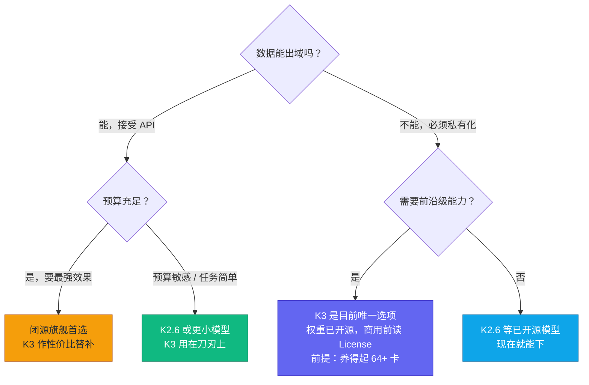

# 二、跑分导读：K3 到底强不强，怎么读才不被带节奏

> 数据核对至 2026-07-28。跑分是最容易被断章取义的部分，所以这篇不只罗列数字，也说清楚每个数字能信几分。

## 先泼冷水：官方自己都说没超过闭源第一梯队

官方博客原话：K3 整体表现**仍落后于 Claude Fable 5 和 GPT-5.6 Sol**，但在其评测集中稳定超过其余被测模型。厂商自己把这句话写进发布博客里不多见，所以看到任何“K3 全面吊打 Claude/GPT”的标题，直接关掉就行。

准确的定位是：开源模型的新天花板，闭源第一梯队的强力挑战者。

## 看跑分前先问三个问题

谁测的？同条件吗？什么时候测的？

厂商自测有动机挑对自己有利的题，和第三方独立复测不是一回事，内部自建基准（比如 KCB 2.0）参考价值还要再打折；agentic 跑分里如果执行框架（harness）都不统一，数字就不是严格对照；榜单排名随新模型发布周周变，不带日期的排名引用都是耽误人。下面读 K3 的数据时，这三条会反复用到。

## 官方跑分里最大的坑：harness 不统一

官方 benchmark 表的脚注里写得清楚，不同模型用了不同的 agent 执行框架（harness）：

- Kimi K3 → 多数用 **Kimi Code** harness
- Claude 系 → Claude Code 或 Terminus 2
- GPT 系 → Codex

harness 决定了模型怎么调工具、怎么管理上下文、怎么重试，对 agentic 跑分影响很大——同一个赛车手开不同的车跑圈速，你比的到底是车手还是车？官方这样做有它的道理（各模型配各自最优 harness），但这意味着表里的数字是方向性证据，不是严格对照实验。同一 harness 跑所有模型的第三方复测，才更接近公平对比。

还有两个脚注级的细节：SWE Marathon 评测中 Claude Fable 5 在 35% 任务上触发了 fallback，官方自己注明“可能拉低了其成绩”；KCB 2.0 是 Kimi 的内部基准，参考价值打个折。

## 第三方独立评测

| 榜单 | K3 成绩 | 排名 | 备注 |
| --- | --- | --- | --- |
| Artificial Analysis 智能指数 v4.1 | 57 | **4 / 189** | 综合推理/编码/知识/agentic/长上下文 |
| Vals Index | 74.70% | **2 / 38** | 排在 Claude Fable 5 之后、GPT-5.6 Sol 之前 |
| Vals Terminal-Bench 2.1 | 80.90% | **第 2** | 三次完整跑平均 |
| Arena WebDev | 1679 分 | **第 1**（初步） | 人类偏好投票，仅 1757 票，会变动 |
| AA 输出速度 | 62 tok/s | — | 官方 API 实测 |
| AA 首 token 延迟 | 1.99 s | — | 推理模型，正常水平 |

三家独立评测给出的排位区间是第 1 到第 4，都在闭源旗舰的贴身距离内。对一个马上就要开权重的模型来说，这个位置之前没有过。

另外 AA 的数据里藏了一条很实用的信息：K3 在整个评测中产出了 1.3 亿输出 token，大约是同价位推理模型中位数的 2 倍。说白了就是 K3 话多、思维链长，实际使用成本要按这个系数放大预估。

## 官方展示的"长时程"案例（比跑分更能说明定位）

跑分卷的是答题，K3 主打的其实是干活。官方 showcase 里最有信息量的四个：

1. **GPU 内核优化**：24 小时沙盒内自主 profile/重写/评测内核，成绩与 Claude Fable 5 相当，明显超过 Opus 4.8 与 GPT-5.6 Sol；且官方透露 K3 开发后期，其早期版本已承担了团队大部分内核优化工作（模型造模型的飞轮已经转起来了）。
2. **从零写 GPU 编译器**：造出 MiniTriton（tile 级 IR + MLIR + PTX 代码生成），部分 workload 性能超过 Triton，并能撑住 nanoGPT 端到端训练收敛。
3. **芯片设计**：48 小时自主跑完一颗 4mm² 推理芯片的设计-优化-验证（开源 EDA + Nangate 45nm，100MHz 时序收敛，仿真 8700 tok/s）——概念验证性质，但"长时程 agentic"的含金量拉满。
4. **科研复现**：2 小时复现计算天体物理 I-Love-Q 关系（通常需要有经验研究者 1–2 周），交叉验证 20+ 篇论文、评估 300+ 状态方程，还顺手发现了已发表公式中的不一致。

这些案例的共性是数小时到数十小时的无人值守自主工作。这才是 K3 和“跑分型模型”的真正区别，也是 1M 上下文加思维链保留设计的用武之地。

## K3 vs K2.6 vs 闭源旗舰：怎么选

| | Kimi K3 | Kimi K2.6 | Claude Fable 5 / GPT-5.6 Sol |
| --- | --- | --- | --- |
| 能力档位 | 开源最强 | 开源中坚 | 闭源天花板 |
| AA 智能指数 | 57 | 44 | 更高 |
| API 价格（入/出） | $3 / $15 | $0.95 / $4 | 更贵 |
| 上下文 | 1M | 256K | 视型号 |
| 可私有化 | ✅ 权重已开源（修改版 MIT） | ✅ 现在就能下 | ❌ |
| 单机可跑 | ❌（64+ 卡） | 勉强（多卡） | — |

怎么选，画成一张图：

---

**来源**：[Kimi K3 官方博客](https://www.kimi.com/blog/kimi-k3)（Full Benchmark Table 及脚注）、[Artificial Analysis](https://artificialanalysis.ai/)、[Vals](https://www.vals.ai/)、Arena WebDev 榜单。第三方数据以 2026-07-17 快照为准，最新数据请点原始链接。

⬅️ 上一篇：[架构拆解](architecture.md) ｜ ➡️ 下一篇：[API 上手](getting-started.md)
