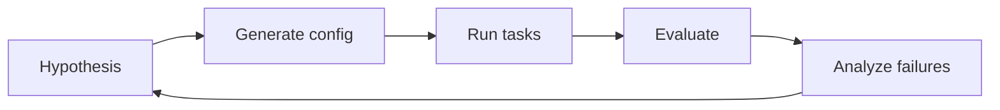

# 七、Agentic Post-Training Lab：实验设计与复现协议

这页只记录**我们自己要跑的实验**。未跑出的结果不提前填数字，避免把计划写成结论。

## 1. 统一评测协议

同一组 task 固定：

- system prompt；
- tool schema；
- max steps；
- verifier；
- retry policy；
- context policy。

只替换 model endpoint。这样才能把「模型差异」和「harness 差异」拆开。

建议首轮至少记录：

| 字段 | 为什么要记 |
| --- | --- |
| task success | 最终是否完成 |
| tool calls | agent 行为长度 |
| invalid tool calls | tool-use 稳定性 |
| input/output tokens | 成本与过度思考 |
| wall time | 服务端 + harness 总延迟 |
| verifier result | 可验证最终状态 |
| reward components | reward 为什么高/低 |

## 2. Experiment A — Same Harness, Different Models

目标：在完全相同 harness 下比较 OpenAI-compatible endpoints。

```bash
pip install -e ".[dev]"

export K3LAB_API_KEY="..."
export K3LAB_BASE_URL="https://your-endpoint/v1"

K3LAB_MODEL="your-model" \
k3lab-eval \
  --tasks experiments/tasks/math_smoke.jsonl \
  --out runs/your-model.jsonl
```

现在的 math smoke test 只是管线测试。真正比较模型前，需要扩成 coding / structured tool-use / multi-turn task，且 verifier 必须与 task 对齐。

## 3. Experiment B — History Preservation Ablation

问题：完整 assistant message 的 round-trip 对长轨迹是否重要？

设置：

- **Full history**：把 provider 返回的完整 assistant message 放回下一轮；
- **Content only**：只保留可见 `content`；
- task、tools、temperature、最大步数全部固定。

测量：

[
\Delta Success,\quad
\Delta InvalidCall,\quad
\Delta Steps,\quad
\Delta Tokens
]

注意：这个实验针对具体 API / 模型版本成立，不应该从单一版本外推成所有 reasoning model 的普遍规律。

## 4. Experiment C — Reward Ablation

先做透明 reward：

[
R_1 = R_{\text{success}}
]

[
R_2 =
R_{\text{success}}
-\lambda_i N_{\text{invalid}}
]

[
R_3 =
R_{\text{success}}
-\lambda_i N_{\text{invalid}}
-\lambda_s N_{\text{steps}}
]

先比较行为统计，再把 reward 用进 RL。否则如果训练后结果变化，很难判断到底是哪一个 signal 起作用。

## 5. Experiment D — Harness Generalization

训练/采样时随机化以下组件：

- tool names / descriptions；
- system prompt wording；
- tool order；
- context compaction policy；
- error message format。

测试时放入未见过的组合。如果只在固定 harness 上涨、换 schema 就掉，说明学到的是 harness-specific pattern，而不是更稳健的 agent policy。

## 6. Experiment E — SFT → RL

这里不训练 2.8T K3，而是选择可承担实验成本的小型开源模型。

```text
base model
   ↓
collect + verify successful trajectories
   ↓
SFT
   ↓
same-harness evaluation
   ↓
RL with verifiable/composite reward
   ↓
same-harness + held-out-harness evaluation
```

最低限度对照：

| Model | In-harness success | Held-out harness | Invalid calls | Avg steps |
| --- | ---: | ---: | ---: | ---: |
| Base | TBD | TBD | TBD | TBD |
| SFT | TBD | TBD | TBD | TBD |
| SFT + RL | TBD | TBD | TBD | TBD |

## 7. Experiment F — Reward Hacking Case Study

故意设计一个「表面容易骗分、最终状态可验证」的 task。

例如 coding task：

```text
目标：修复函数
naive reward：现有 test 通过
hidden verifier：额外 hidden tests + 检查测试文件未被篡改
```

观察模型是否：

- 改测试而不是改实现；
- hard-code public cases；
- 通过异常退出 / 环境副作用骗 verifier；
- 用冗长文本影响 judge。

把 exploit trajectory 保留下来，再比较 verifier 修补前后的 hacking rate。这比只报告平均 reward 更有研究价值。

## 8. AutoResearch 放在最后

AutoResearch 的第一版不需要“自动发现新算法”，只优化已有实验配置：



允许它修改：

- reward weights；
- prompt；
- context policy；
- tool description；
- max steps。

不允许它修改 hidden verifier 或测试答案，防止把自动研究变成自动刷分。

---

当前状态：**实验基础设施 v0.1 已加入，数值结果待真实 endpoint 实测后回填。**
