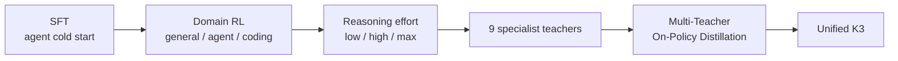
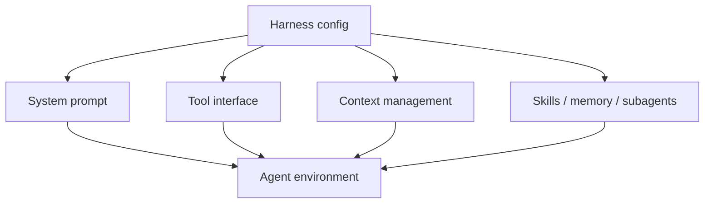

# 六、K3 后训练：从 SFT、Agentic RL 到 MOPD

> 核对至 2026-09-27。本文把 K3 技术报告里的后训练主线单独拆出来，并明确区分「K3 官方做法」和「本仓库可复现实验」。后者是教学/研究实现，不声称复现 K3 的训练规模或内部数据。

K3 的价值不只在 2.8T 架构。对 Agent 研究更有意思的是，它把 **SFT、分领域 RL、可组合 harness、可验证环境、生成式 reward model 和多教师 on-policy distillation** 放进了同一条后训练流水线。

## 1. 官方后训练主线

技术报告把后训练概括成三段：



### SFT：先让模型会执行复杂轨迹

K3 的 SFT 不只是普通问答。报告描述了面向复杂 agentic task 的轨迹合成、多阶段验证与 human-in-the-loop 标注，并使用统一的 XTML chat template 序列化复杂交互。SFT 的作用是提供后续 RL 的 cold start，而不是终点。

### RL：按「领域 × reasoning effort」训练专家

K3 把 RL 扩展到三个大域：

- general：通用经验、视觉、推理、事实性、搜索、knowledge work；
- general agent：长时程 assistant、deep research、长文写作等；
- coding agent：SWE、coding experience、kernel、web development 等。

同时又训练 low / high / max 三档 reasoning effort，因此最后得到 3 × 3 = 9 个专家策略。报告还引入 per-problem token budget：超出预算的轨迹会被惩罚，用来训练不同 effort 档位，而不是简单在推理时截断输出。

### MOPD：不是把 9 个模型直接做权重平均

最后通过 Multi-Teacher On-Policy Distillation (MOPD) 把九个专家能力收回一个 student。训练时按 domain 和 effort 选择对应 teacher，在 student 自己的 on-policy token 上计算 teacher/student 概率差得到 dense reward，并做 clipping 以稳定训练。

这一步的研究意义很直接：**specialization 和 deployment 不必二选一**。可以先把不同能力分别强化，再在 policy space 里做统一。

## 2. 为什么 harness 本身也要成为训练变量

K3 报告明确指出：如果 RL 始终使用同一套固定 harness，模型可能过拟合某一种 tool schema、system prompt、context management 或 interaction protocol。

因此它把 agent harness 拆成可组合模块，例如：



这件事和「公平 benchmark」其实是同一个问题的两面：

- 评测时：不同 harness 会成为混杂变量；
- 训练时：固定 harness 会变成过拟合对象。

所以本仓库新增的实验代码把 **model provider** 和 **harness** 分开，目标是在同一 harness 下替换 Kimi / DeepSeek / Qwen 等 OpenAI-compatible endpoint，再逐步做 harness randomization。

## 3. Reward：可验证任务和开放任务不能混成一个 judge

对能程序化判定的任务，优先用环境最终状态、测试、规则等 verifier。对不容易直接验证的开放任务，K3 使用 Agentic Generative Reward Model (GRM)：judge 先看产物，再生成 rubric，逐项评分并记录 scorepad。

报告还特别讨论 reward hacking。一个简单例子是：模型可能通过写更长、更像「完整答案」的文本骗过偏好 judge。因此 K3 对开放任务加入 verbosity budget，超过相对预算的候选会在比较中直接吃亏。

本仓库第一版 reward system 刻意保持透明：

[
R =
w_s R_{\text{success}}
- w_i N_{\text{invalid tool call}}
- w_t N_{\text{tool step}}
]

先用 deterministic verifier 把数据闭环跑通，再增加 LLM judge / rubric reward。这样每一次收益都能解释，而不是一开始就把所有信号揉成一个黑盒分数。

## 4. 长轨迹为什么需要 replay 和持久环境

长时程 Agent RL 的难点不只是「一次 rollout 很长」，还包括环境状态本身。K3 使用 partial rollout，让未完成的长轨迹跨训练 iteration 继续；其 AgentENV 则提供面向 agentic workload 的 microVM sandbox、pause/resume、fork 和 snapshot。

本仓库不尝试复刻这一基础设施规模，但保留两个最关键的研究接口：

1. **trajectory logging**：记录 tool call、arguments、observation、最终答案和 reward；
2. **trajectory replay**：对确定性工具重新执行，检查同一动作能否得到同一环境结果。

这两件事是后续做 RL、reward debugging 和 reward-hacking case study 的地基。

## 5. 本仓库现在能复现什么

当前 `src/k3lab/` 是一个最小但可运行的实验骨架：

```text
src/k3lab/
├── providers/      # OpenAI-compatible model adapter
├── harness/        # agent loop + tool registry + trajectory logger
├── rewards/        # verifier + compositional reward
├── schema.py
├── eval.py         # same-harness evaluation
└── replay.py       # deterministic trajectory replay
```

第一阶段故意只放安全、确定性的 calculator task。它不是为了证明哪个模型强，而是先验证：

```text
Model
  → Harness
  → Tool / Environment
  → Trajectory
  → Verifier
  → Reward
  → Replay
```

这条链是不是完整、可观测、可复现。

## 6. 下一轮实验

后续按下面顺序推进，而不是直接堆一个“大而全 Agent”：

| 阶段 | 实验问题 | 关键指标 |
| --- | --- | --- |
| A | 同一 harness 下换模型，会发生什么？ | success、invalid calls、steps、tokens |
| B | 保留 vs 丢弃完整 assistant history | long-horizon success、tool error、turns |
| C | outcome-only vs composite reward | success、steps、reward hacking rate |
| D | fixed harness vs randomized harness | in-harness / out-of-harness generalization |
| E | SFT successful trajectories | success gain、format/tool stability |
| F | SFT + RL (small open model) | reward、success、KL / length drift |
| G | AutoResearch | 自动提出配置→实验→分析→下一轮假设 |

这里最重要的原则是：**先有控制实验，再谈训练收益。**

---

**主要来源**

- Kimi Team, *Kimi K3: Open Frontier Intelligence*, 2026-07-27: https://arxiv.org/abs/2607.24653
- AgentENV: https://github.com/kvcache-ai/AgentENV

⬅️ 上一篇：[已知局限与踩坑](limitations.md) ｜ ➡️ 实验设计：[Agentic Post-Training Lab](experiments.md)
